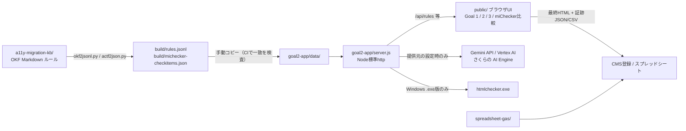

# プロジェクト概要

公共団体向けCMS（SMART CMS）への自治体サイト移行と、移行時に行うアクセシビリティ修正を効率化するためのワークスペースである。
移行作業者と承認者は、旧サイトの本文HTMLをCMSに登録し直す際、WCAG 2.0/JIS X 8341-3と総務省の評価ツールmiCheckerに沿って目視で修正している。
このリポジトリは、その修正ルールをナレッジベース（`a11y-migration-kb/`）として体系化し、修正候補を確認して最終HTMLと証跡を出力する実行画面群（`goal2-app/`。Goal 1〜3の画面とmiChecker結果比較）を提供する。
事業前提、作業フロー、制約は `AGENTS.md` に、3つのゴール（Goal 1: 一括最適化、Goal 2: ページ単位支援、Goal 3: 本文抽出）は `workstream.md` にある。

## 現在の技術構成

| 分類 | 技術 | 用途 | 根拠となるファイル |
| --- | --- | --- | --- |
| 言語 | JavaScript (CommonJS) | サーバー、ブラウザUI、テスト、分析ツール | `goal2-app/package.json` (`"type": "commonjs"`)、`goal2-app/server.js`、`goal2-app/public/*.js` |
| 言語 | Python 3 | ナレッジベースのMarkdownからJSONLを生成するジェネレータ | `a11y-migration-kb/tools/okf2jsonl.py`、`actf2json.py`、`gen_michecker_inventory.py` |
| 言語 | Google Apps Script | 移行記録スプレッドシートの作業時間計測サイドバー | `spreadsheet-gas/Code.gs`、`Index.html`、`appsscript.json` |
| ランタイム | Node.js 20以上 | 実行画面群（Goal 1〜3、miChecker結果比較）のHTTPサーバー | `goal2-app/package.json` (`engines.node >=20`)、`goal2-app/Dockerfile` (`node:20-alpine`) |
| フレームワーク | なし（Node標準 `http` モジュール） | 静的配信、ルールAPI、URL取得API、LLM中継API。npm依存は0件 | `goal2-app/server.js`、`goal2-app/package.json` (`dependencies` なし) |
| UI | 素のHTML/CSS/JS | Goal 2候補確認画面 (`index.html`/`app.js`)、Goal 3抽出画面 (`goal3.html`)、Goal 1画面 (`goal1.html`)、miChecker比較画面 (`michecker-compare.html`)、検証ガイド (`verification-guide.html`)、概要スライド (`verification-slides.html`) | `goal2-app/public/` |
| データ保存 | JSONL/JSONファイル（読み取り専用） | KBルール62件とmiChecker公式チェック項目を起動時に読み込む。永続化DBは無い | `goal2-app/data/rules.jsonl`、`goal2-app/data/michecker-checkitems.json`、`a11y-migration-kb/build/` |
| ナレッジ形式 | OKF (Open Knowledge Format) Markdown + フロントマター | 1ルール1ファイルの移行ルールグラフ。ジェネレータでJSONL化 | `a11y-migration-kb/README.md`、`a11y-migration-kb/rules/` |
| 外部サービス | Google Gemini API / Vertex AI（本番は東京の Vertex AI の Gemini 3.5 Flash、2026-09-25 から）、さくらの AI Engine（切り替えの仕組みのみ、本番は未使用） | 画像alt下書きなどのLLM補助。提供元（`GEMINI_API_KEY`、`GEMINI_AUTH_MODE=adc`、さくらの `LLM_*_PROVIDER` と `SAKURA_AI_API_KEY`）を何も設定していなければ呼び出されない | `goal2-app/lib/llm.js`、`goal2-app/lib/llm-prompts.js`、`goal2-app/LLM_DATA_POLICY.md` |
| 外部ツール | miChecker / htmlchecker.exe (Eclipse ACTF) | ローカルWindows版でのアクセシビリティ検査の自動実行。公式チェック項目定義を同梱 | `goal2-app/server.js`（`MICHECKER_HTMLCHECKER_EXE`）、`a11y-migration-kb/vendor/eclipse-actf/` |
| インフラ・配信 | Google Cloud Run (asia-northeast1) + Cloud Build + Artifact Registry | ホスト版の配信。手元PowerShellから `gcloud builds submit` と `gcloud run deploy` で手動デプロイ | `goal2-app/Dockerfile`、`goal2-app/CLOUD_RUN_DEPLOY.md` |
| インフラ・配信 | Node.js SEA (Single Executable Applications) + esbuild + postject | Windows向け単一 `.exe` 配布 | `goal2-app/build-windows-app.bat`、`goal2-app/sea-config.json`、`goal2-app/LOCAL_WINDOWS_APP.md` |
| テスト | Node標準 `assert` + 自作ランナー | サーバー起動を含む統合テスト、LLM呼び出しテスト（モック）、miChecker互換テスト、表ネストテスト、出力テスト。外部テストフレームワークは無く、ブラウザを使うテストだけがPlaywrightを使う | `goal2-app/test/run-tests.js`、`goal2-app/test/*/` |
| CI | GitHub Actions | pull requestとmainへのpushで、一時生成物の混入、KB生成物とアプリ内コピーの一致、`goal2-app` のテストを確かめる。デプロイは含まない | `.github/workflows/ci.yml`、`scripts/ci/` |
| 開発ツール | Claude Code / Codex 向け指示ファイルとスキル | エージェント作業方針、日本語スタイル指針、変更履歴 | `AGENTS.md`、`.claude/skills/natural-japanese/`、`CHANGELOG.md`、`done-definition.md`、`memory/` |

Lint、フォーマッター、lockファイルは存在しない。CIはテストと検査だけで、デプロイは手動のままである。

## アーキテクチャ

主要コンポーネントは3つで、ナレッジベースがルールの正本、実行画面がその適用先、スプレッドシートGASが作業記録の補助という関係にある。



データの流れは次の通り。

1. 作業者はGoal 3画面で旧ページ全体HTMLから本文を抽出するか、Goal 2画面に本文HTML断片を直接貼り付ける。
2. ブラウザ側の `app.js` がKBルールに基づいて修正候補を生成し、作業者は候補ごとに採用、編集して採用、却下、要確認を選ぶ。
3. 画面は最終HTMLと証跡（JSON/CSV）を出力し、作業者がCMSとスプレッドシートへ手動で反映する。
4. miChecker比較画面は、移行前後の検査結果CSVを読み込み、指摘を新規、未解消、解消に分類してKBルールへ逆引きする。

候補生成のロジックはサーバーではなくブラウザ側の `public/app.js`（約8,400行）にある。
サーバーはルール配信、URL取得（SSRF対策付き）、LLM中継、htmlchecker.exe実行に限られる。

## 重要な設計判断

- **npm依存なしのNode標準サーバー**を採用している。Cloud RunとWindows単一 `.exe` の両方へ同じ `server.js` を配布するためで、SEA化の手順書がその制約を説明している（`LOCAL_WINDOWS_APP.md`）。
- **ナレッジベースを1ルール1Markdown（OKF）で管理**し、JSONLは生成物として扱う。ルール本文と根拠（WCAG/JIS、miCheckerチェック項目ID）を人が読める形で保つためである（`a11y-migration-kb/README.md`）。
- **修正対象を本文コンテンツに限定**する。テンプレート起因の指摘は `content`、`old-site-template`、`new-cms-template`、`unknown` に分類し、本文起因のものだけを修正候補にする（`AGENTS.md`）。
- **miCheckerを主基準ではなく品質ゲート候補**として扱う。KB全ルールを既定とし、miChecker指摘のみへ絞るモードは案件の検収条件を確認したうえで使う（`AGENTS.md`）。
- **LLM連携は既定で無効**。実案件HTMLと画像を外部LLMへ送る合意が未確定のため、提供元の設定（`GEMINI_API_KEY`、`GEMINI_AUTH_MODE=adc`、`SAKURA_AI_API_KEY` など）を運用判断に委ねている（`goal2-app/LLM_DATA_POLICY.md`）。
- **LLM の提供元はさくらの AI Engine に寄せる**（2026-09-24、ユーザー確定）。切り替えの仕組み（L1、`lib/llm.js` の `callLlm()` とアダプター）は入ったが、本番はまだ Gemini のままである。他のプロジェクトで使っていて契約が済んでいるためで、Gemini は受け皿とつなぎとして残す。ISMAP は、公開済みページで機密性が低いため、いまは求めない。段階と検証は `goal2-app/LLM_PROVIDER_SWITCH_INSTRUCTIONS.md`、比較は `memory/llm-provider-alternatives-research.md` にある。
- **本番運用は、Cloud Run を IAP で守り、証跡を共有ドライブに置く**（2026-09-25、ユーザー確定）。作業者は会社の Google Workspace のアカウントでログインする。LLM への送信の同意は営業が案件ごとに取り、記録は持たない。どの提供元に送ったかは証跡の JSON に残す（L3）。証跡は承認者が共有ドライブで見る。保存期間の決まりは無い。段階（手元で動くサーバーの守り、IAP、同意と証跡、L3、Node 24）は `goal2-app/PRODUCTION_OPERATIONS_INSTRUCTIONS.md` にある。
- **AI生成は部品別Skillと生成後レビューで扱う**。table、画像alt、見出しなど失敗パターンが異なる部品を同じプロンプトで処理しない（`AGENTS.md`、`memory/ai-accessibility-skills-policy.md`）。
- **ディレクトリ名 `goal2-app` は変えない**（2026-09-24）。Goal 2の画面から始まった名残で、いまはGoal 1〜3とmiChecker結果比較を含む。Windows版の `goal2-app.exe`、設定の保存先 `%APPDATA%\goal2-app`、Cloud Runの手順書がこの名前を参照しているためで、package名と説明だけを範囲に合わせた（`a11y-migration-app`）。
- **Cloud Runをホスト第一候補**にした理由は `memory/goal2-hosting-candidates.md` にある。認証、永続保存、ログ方針は未決定のまま公開URLで運用している。
- 候補生成ロジックをブラウザ側に置いた理由は、実装から読み取れない。理由未確認。
- 外部検査エンジン（axe-core、A11yc library）を組み込まない判断は、`memory/project-state.md` で未決定として残っている。理由未確認。

## 実行と検証

開発環境の起動は次の通り。

```bash
cd goal2-app
npm start        # http://localhost:8080
```

テストは次の通り。すべて `goal2-app/` 内で実行する。

```bash
npm test                      # 統合テスト（サーバーを起動して検証）
npm run test:llm              # LLMの呼び出し（モックのサーバー）
npm run test:michecker-parity
npm run test:table-nesting
npm run test:goal2-output
npm run test:saga-gold        # 佐賀市 old/gold fixture との比較（CIでは動かさない）
```

テストで起動するサーバーにはLLM関係の環境変数を渡さない（`goal2-app/test/server-env.js`）。CIはNode 20（Dockerfileと同じ版）で上の `test:saga-gold` 以外を動かす。佐賀市fixtureは非公開の `koteikara/gemini-a11y-agent` にあり、手元では `.tmp-gemini-a11y-agent` に置く。

リポジトリの検査は次の通り。リポジトリのどこからでも実行でき、CIも同じものを動かす。

```bash
node scripts/ci/check-tracked-files.js   # 一時生成物や鍵のファイルが追跡されていないか
node scripts/ci/check-kb-build.js        # KB生成物が作り直した結果とアプリ内のコピーに一致するか（Python 3が要る）
```

リポジトリに入れるファイルと入れないファイル（fixture、サンプル、評価の記録、一時生成物）の分け方は `goal2-app/README.md` の「検証用のデータと一時ファイル」にある。

ナレッジベースのJSONL再生成は次の通り。生成後、`build/` の2ファイルを `goal2-app/data/` へ手動でコピーする。自動同期は無いが、コピーし忘れるとCIの `check-kb-build.js` が失敗する。

```bash
cd a11y-migration-kb
python3 tools/okf2jsonl.py --bundle . --out build/rules.jsonl
python3 tools/actf2json.py --bundle . --out build/michecker-checkitems.json
```

ビルドとデプロイは2系統ある。

- Cloud Run: `goal2-app/CLOUD_RUN_DEPLOY.md` のPowerShell手順で、GitHubの `main` を別フォルダへ同期してから `gcloud builds submit` と `gcloud run deploy` を実行する。
- Windows `.exe`: `goal2-app/build-windows-app.bat` を実行する。Node.js 20以上とsigntoolが必要（`LOCAL_WINDOWS_APP.md`）。

環境変数名は次の通り（値は記載しない）。

- サーバー: `PORT`、`GOAL2_RULES_PATH`、`GOAL2_MICHECKER_CHECKITEMS_PATH`
- LLM: `GEMINI_API_KEY`、`GEMINI_MODEL`、`GEMINI_AUTH_MODE`、`GEMINI_VERTEX_PROJECT`、`GEMINI_VERTEX_LOCATION`、`GEMINI_TEMPERATURE`、`GEMINI_THINKING_LEVEL`、`LLM_MAX_CALLS_PER_MINUTE`、`GEMINI_INPUT_PRICE_PER_1M_TOKENS`、`GEMINI_OUTPUT_PRICE_PER_1M_TOKENS`、`USD_JPY_RATE`、`LLM_TEXT_PROVIDER`、`LLM_VISION_PROVIDER`、`LLM_FALLBACK_PROVIDER`、`LLM_REQUEST_TIMEOUT_MS`、`LLM_RECORD_DIR`、`SAKURA_AI_*`（一覧は `goal2-app/README.md`）
- ローカル検査: `MICHECKER_HTMLCHECKER_EXE`、`PLAYWRIGHT_CHROMIUM_PATH`
- テスト: `TABLE_TEST_PORT`、`OUTPUT_TEST_PORT`、`LLM_TEST_PORT`
- リポジトリの検査: `PYTHON`（`check-kb-build.js` が使うPythonのコマンド名）

## ForLLMとの関連

- `[[AI・自動化]]` — Gemini連携による画像alt下書き、KBルールに基づく修正候補の自動生成、AI生成を部品別Skillと生成後レビューで扱う方針を実装している。LLMへのデータ送信ポリシーの判断もここに蓄積する。
- `[[UI・デザイン]]` — 作業者向けの候補確認画面、miChecker比較画面、検証ガイドを素のHTML/CSSで作っている。アクセシビリティ規則（WCAG/JIS、miChecker）の適用先として参照する。
- `[[開発・トラブルシューティング]]` — Cloud Runの手動デプロイ、Node SEAによるWindows `.exe` ビルド、htmlchecker.exe連携の障害対応の知識を蓄積する。

## 未解決事項

- lockファイルが無い。npm依存が0件のため現状は問題にならないが、ビルド時に `npx esbuild` と `npx postject` を未固定バージョンで取得している。
- Cloud Run の IAP、証跡の置き場所と名前の決まり、Windows 版の待ち受けの守りは、決めたが未実施である（`goal2-app/PRODUCTION_OPERATIONS_INSTRUCTIONS.md` の P0〜P2）。Windows 版は、同じネットワークの別の機器や、ブラウザーで開いた別のサイトから、htmlchecker.exe のパスを書き替えて任意の実行ファイルを動かせる作りになっており、P0 で塞ぐ。
- CMS入力欄で許可されるHTMLタグと属性の制約は未確認で、最終HTML出力に反映されていない。
- `goal2-app/Dockerfile`（`node:20-alpine`）とCIはNode 20で動かしているが、Node 20は2026-04-30にサポートが終わっている。Node 24 へ上げる（同じ設計書の P4）。
