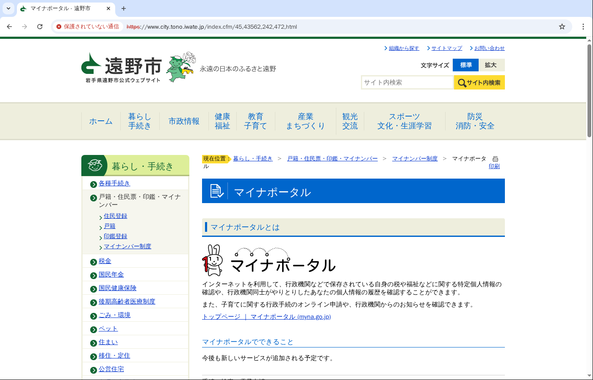
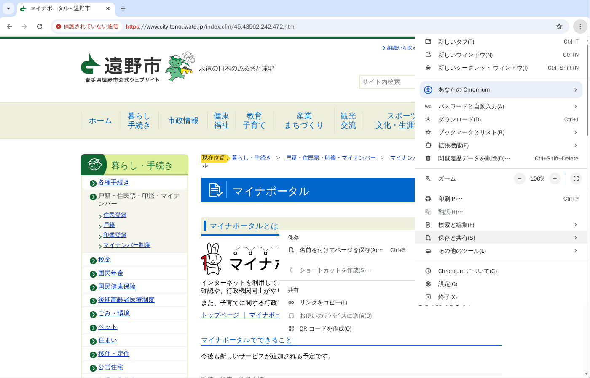
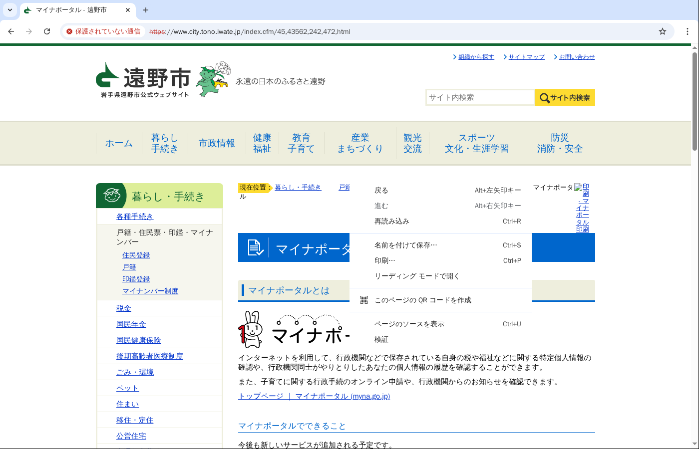
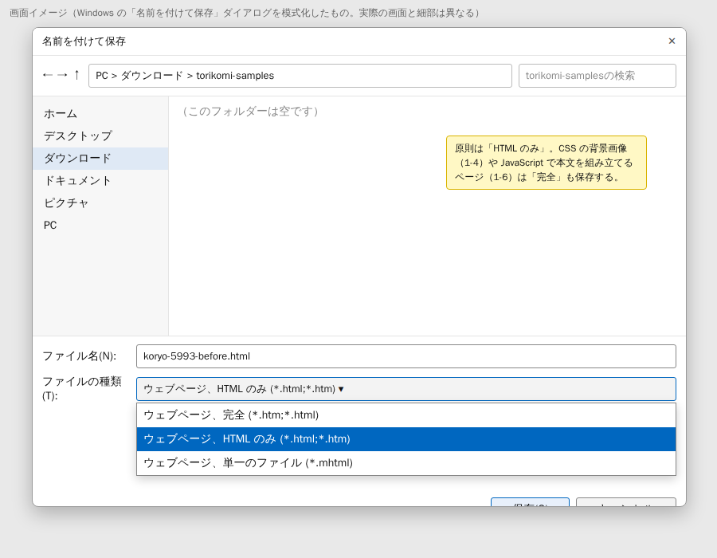
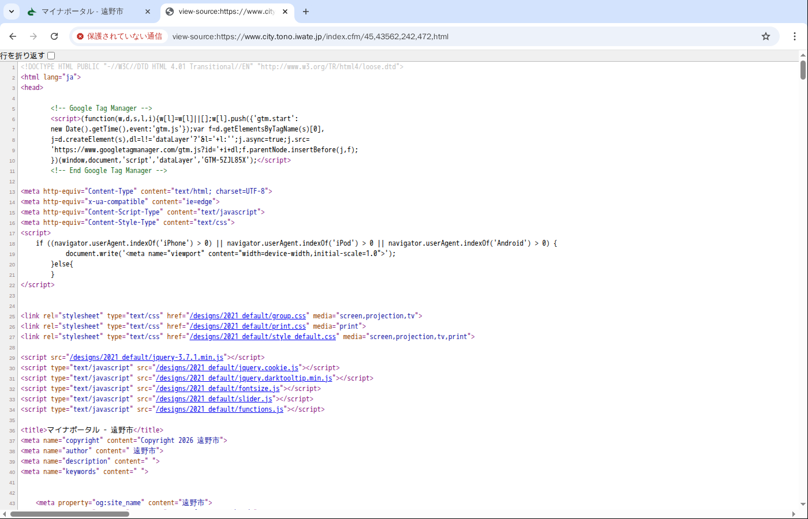
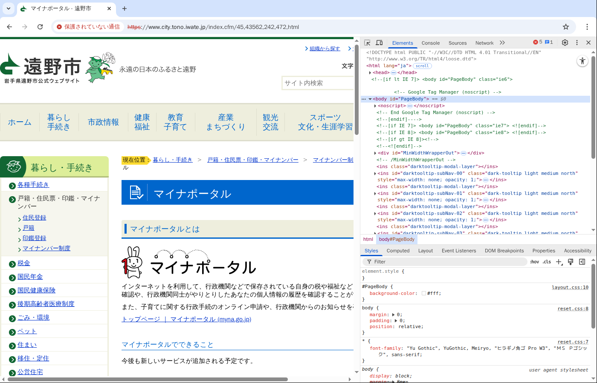
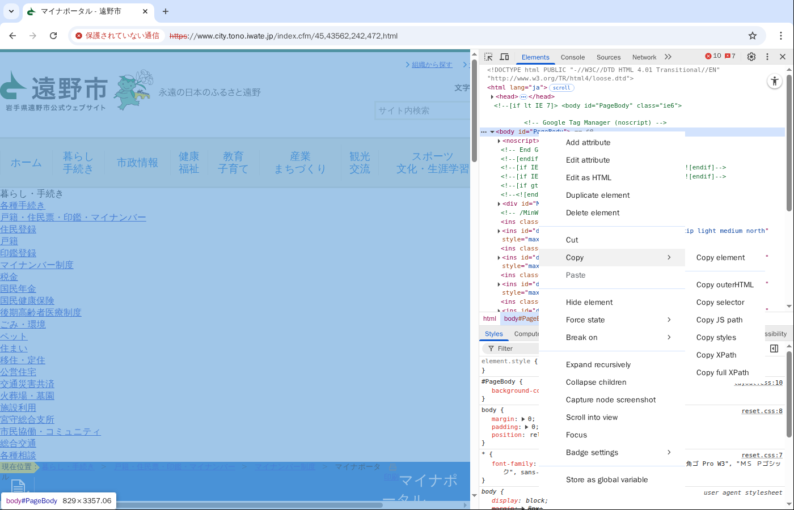

# Chrome でページの HTML を保存する手順

作成日: 2026-09-18

## 目的

`memory/cms-migration-import-failure-patterns.md` の各項目を再現するための HTML を、ページが消える前に手元へ残す。
対象は2種類ある。

- 取込前の元ページ（自治体サイト）。
- 取込後のページ（`migrate.smart-lgov.jp` など。ログインが要る）。

この手順は Windows の Google Chrome を前提にする。
図は Linux の Chromium で撮ったため、メニューの並びは同じだが細部が異なる（アドレスバーに「保護されていない通信」と出ているのは撮影環境の都合で、実際は鍵マークになる。DevTools の表記が英語なのも同じ理由）。

## 1. 準備

- 元ページが VPN 経由でしか開けない場合は、先に VPN につなぐ。
- 取込後のページは、先に CMS にログインしておく。
- 保存先のフォルダを1つ決める（例: `ダウンロード\torikomi-samples`）。
- ファイル名は `<項目番号>-<自治体>-<before|after>.html` にする。例: `1-1-koryo-before.html`、`1-4-wake-after.html`。同じページを「完全」でも保存するときは `-complete` を足す。

## 2. 方法A（原則）: Ctrl+S で「ウェブページ、HTML のみ」

1. 保存したいページを開く（図1）。
2. `Ctrl+S` を押す。メニューから開くなら、右上の「⋮」→「保存と共有」→「名前を付けてページを保存」（図2）。ページ上で右クリック →「名前を付けて保存」でも同じ（図3）。
3. 「名前を付けて保存」のダイアログで、「ファイルの種類」を「ウェブページ、HTML のみ」にし、ファイル名を付けて「保存」を押す（図4）。

「HTML のみ」で保存されるのは、Chrome がサーバーから受け取った HTML そのものである。JavaScript が動いたあとの状態ではない。CMS 取込ツールが読むのもこの形なので、原則はこちらを使う。
保存したファイルを Chrome で開くと画像や CSS が外れて見えるが、それで正しい。

図1 保存したいページを開いたところ。右上の「⋮」がメニュー。

図2 「⋮」→「保存と共有」→「名前を付けてページを保存」。ショートカットは Ctrl+S。

図3 ページ上の右クリックメニュー。「名前を付けて保存」「ページのソースを表示」「検証」をこの手順で使う。

図4 「ファイルの種類」で「ウェブページ、HTML のみ」を選ぶ。この図は Windows のダイアログを模式化したもので、実際の画面と細部は異なる。

## 3. 方法B: 「ウェブページ、完全」で保存する

次の項目は、HTML だけでは足りない。

- 1-4 CSS の背景画像（画像の指定が CSS 側にある）。
- 1-6 JavaScript で本文を組み立てているページ。

このときは方法Aに加えて、同じダイアログで「ファイルの種類」を「ウェブページ、完全」にしてもう一度保存する。
「完全」は表示中の状態（JavaScript が動いたあとの DOM）を書き出し、CSS と画像を `<ファイル名>_files` というフォルダに保存する。背景画像を指定している CSS もこのフォルダに入る。
渡すときは `.html` と `_files` フォルダをまとめて zip にする。

## 4. 方法C: 保存する前に「ページのソースを表示」で中身を確かめる

`Ctrl+U`（または右クリック →「ページのソースを表示」）で、Chrome が受け取った HTML をそのまま見られる（図5）。
保存する前に、探している形が入っているかを `Ctrl+F` で確かめる。

| 項目 | 探す文字列 |
| --- | --- |
| 1-1 リスト内のファイルリンク | `<li>` の中の `.pdf` |
| 1-2 アイコン付きファイルリンク | `<a` の前後の `<img` |
| 1-3 `data:` 形式の画像 | `data:image` |
| 1-5 非対応形式 | `.odt`、`.webp` |
| 1-7 不要な属性 | `file_size`、`data-foreign-domain` |
| 2-② SVG | `.svg` |

左上の「行を折り返す」にチェックを入れると、長い行が読みやすい。

図5 「ページのソースを表示」。アドレスバーの先頭が `view-source:` になる。この画面で Ctrl+S を押すと、ソースをそのまま保存できる。

## 5. 方法D: 本文の一部だけを取り出す（DevTools）

ページ全体ではなく、本文のブロックだけが要るときに使う。取込後のページからテンプレート部分を除いて本文だけ取るときにも使える。

1. 取り出したい本文の上で右クリック →「検証」（図3）。
2. DevTools が開き、「要素」（Elements）パネルでその要素が選ばれる（図6）。本文のブロック全体を取りたいときは、ツリーの上の行をクリックして親の要素へ移る。
3. 選んだ行を右クリック →「コピー」（Copy）→「outerHTML をコピー」（Copy outerHTML）（図7）。
4. メモ帳などに貼り付け、`.html` の拡張子で保存する。

方法Dで取れるのは表示中の DOM である。JavaScript で書き換わったあとの形なので、方法Aの HTML と一致しないことがある。どちらを渡したかをファイル名かメモに残す。

図6 DevTools の「要素」パネル。選ばれている行が、右クリックした場所の要素。

図7 ツリーの行を右クリックすると出るメニュー。「コピー」→「outerHTML をコピー」でその要素の HTML がクリップボードに入る。

## 6. 取込後のページ（CMS 側）の注意

- ログインしたあとに同じ手順で保存する。`www03.migrate4.smart-lgov.jp` の `torikomi_test` はログイン画面へ飛ぶので、先にログインする。
- 取込後のページには CMS のテンプレート（ヘッダー、ナビゲーション、フッター）が含まれる。本文だけが要るときは方法Dで `free-layout-area` の中を取る。
- 顧客コードや内部の URL など、外に出せない情報が入っていないかを確かめてから共有する。
- 取込後の URL が 404 のもの（広陵町、神栖市、那珂川町の元ページ）は、CMS 側の取込履歴から取込時の HTML を取り出す。取り出し方は CMS の担当に確認する。

## 7. 今回保存してほしいもの

| 項目 | ページ | 方法 | ファイル名の例 |
| --- | --- | --- | --- |
| 1-1 | 広陵町 元ページ（`contents_detail.php?co=kak&frmId=5993`） | A | `1-1-koryo-before.html` |
| 1-1 | 広陵町 取込後（6822） | 404。CMS の取込履歴 | `1-1-koryo-after.html` |
| 1-4 | 和気町 取込後（migrate4 の 239、ログイン要） | A と B | `1-4-wake-after.html`、`1-4-wake-after-complete.zip` |
| 1-7 | 神栖市 取込後（5833） | 404。CMS の取込履歴 | `1-7-kamisu-after.html` |
| 1-2、1-3 | 那珂川町 元ページ（105、25） | 404。CMS の取込履歴があれば | `1-2-nakagawa-before.html`、`1-3-nakagawa-before.html` |
| 1-5 | 飯島町（webp の例） | 404。同じサイトで webp を使う別のページがあればそれを A で | `1-5-iijima-before.html` |

このほかは、この環境から取れている（上板町の ODT、神栖市の現在の HTML、遠野市の SVG、那珂川町の取込後2件）。

## 8. 渡し方

- 保存したファイルは、チャットに添付するか、共有フォルダに置いてパスを知らせる。
- 元ページ（公開されている自治体サイト）の HTML は、内容を確認したうえでリポジトリの `goal2-app/test/fixtures/` 配下に置ける。取込後のページは内部情報を含むので、リポジトリに入れる前に判断する。
